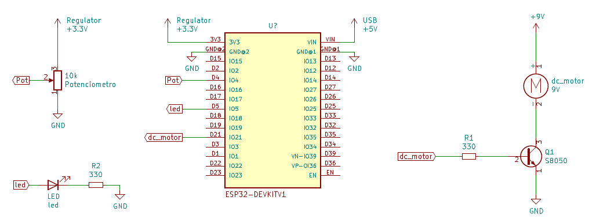

# Controle de Velocidade de Motor DC com PWM

### Resumo

Podemos controlar a velocidade de rotação de um motor DC usando um resistor variável para limitar a corrente que passa pelo motor, mas essa não é a melhor opção pois há uma dissipação de potência no resistor variável e uma perca de torque do motor.
Uma opção muito mais viável é usar PWM, pois, alterando o duty cicle do PWM podemos controlar o motor sem perda de torque e sem dissipar potência desnecessariamente.

Neste projeto usamos um motor de 9V, então não podemos fornecer a potência necessária do motor pelas saídas de 3.3V do ESP, para solucionar isso, o motor está conectado a uma bateria de 9V e usa um transistor s8050 como chave. A base do transistor vai conectada na saída do ESP32 que é a saída do Sinal PWM, assim conseguimos usar o ESP para controlar a velocidade do motor.

A entrada do sistema é um potenciômetro ligado à alimentação do ESP. O duty cicle do PWM é alterado de acordo com o valor de tensão do Potenciômetro na entrada do ESP.

Temos também um LED como saída para sinalização. O LED está ligado ao PWM, então a intensidade do brilho do LED está relacionado com o valor do duty cicle.

### Esquemático do Hardware 

Podemos ver na imagem o esquemático do circuito.

### Como Usar

Para clonar projetos do PlatformIO como esse, siga o guia passo-a-passo disponível no repositório: [Instrucoes-PlatformIO](https://github.com/Zebio/Instrucoes-PlatformIO)
